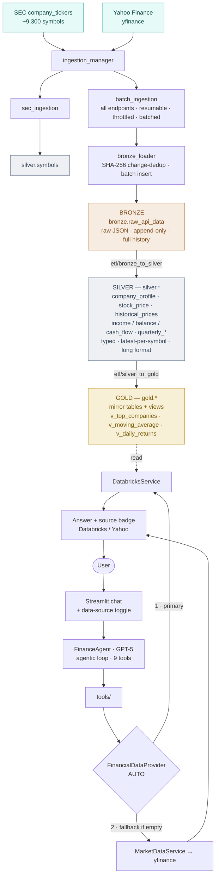

# finance-agent — Architecture

A Databricks **medallion** pipeline that ingests SEC symbols and Yahoo Finance
market data, refines it through **Bronze → Silver → Gold**, and serves it to an
LLM research agent — with a live Yahoo fallback and full data-source provenance.

**Stack:** Databricks Unity Catalog · yfinance · OpenAI (GPT-5) · Streamlit ·
Docker + GitHub Actions.

---

## Diagram



---

## The medallion layers (`finance_catalog`)

| Layer | Schema | Holds | Key property |
|-------|--------|-------|--------------|
| **Bronze** | `bronze.raw_api_data` | Raw API JSON exactly as received | Append-only; a new row **only when the payload hash changes** (SHA-256), so full history is retained without duplicates |
| **Silver** | `silver.*` | `symbols`, `company_profile`, `stock_price`, `historical_prices`, `income_statement`, `balance_sheet`, `cash_flow`, and `quarterly_*` | Parsed & typed from Bronze JSON; **latest snapshot per symbol**; financial statements exploded to **long format** (`fiscal_year · metric · value`) |
| **Gold** | `gold.*` | Business-ready mirror tables + analytics views (`v_top_companies`, `v_company_snapshot`, `v_daily_returns`, `v_moving_average`) | The **only layer the app reads** |

---

## Build-time: the data pipeline

1. **Sources** — SEC `company_tickers` (master symbol + CIK list) and Yahoo
   Finance via `yfinance` (profiles, prices, 1-year history, annual + quarterly
   financials).
2. **Ingestion** (`ingestion/`, orchestrated by `ingestion_manager`):
   - `sec_ingestion` → batched load into `silver.symbols`.
   - `batch_ingestion` → **resumable, throttled, batched** pull of all 9 Yahoo
     endpoints for every active symbol. Skips symbols already in Bronze before
     any request, so it is safe to stop and re-run to drain rate-limited
     failures.
   - `bronze_loader` → SHA-256 change-dedup, batched inserts into Bronze.
3. **ETL** (`etl/`):
   - `bronze_to_silver` → parse Bronze JSON into typed Silver tables (dedup to
     the latest snapshot per symbol; melt financial statements to long format).
   - `silver_to_gold` → publish Gold tables (mirrors of Silver) + views.

> **One run at a time.** Bronze uses a `GENERATED ALWAYS AS IDENTITY` column and
> the ETLs are full-refresh (`DELETE` + batched insert), so concurrent runs
> conflict on Delta metadata. Never launch two ingestion or ETL runs at once.

---

## Runtime: the research agent

```
User → Streamlit (chat + data-source toggle)
     → FinanceAgent (GPT-5, agentic loop, 9 tools)
     → tools/ → FinancialDataProvider [AUTO]
                  1. DatabricksService → gold.*   (SQL connector)   ← primary
                  2. MarketDataService → yfinance                   ← fallback if empty
     → Answer + provenance badge (🟢 Databricks / 🟡 Yahoo / ⚠️ not found)
```

The provider records **which backend served each call**, surfaced in the
Streamlit UI as a per-answer source badge. The sidebar toggle forces
`Auto` / `Databricks-only` / `Yahoo-only`.

---

## Codebase layers

| Directory | Contents |
|-----------|----------|
| `warehouse/` | Databricks DDL — `create_catalog`, `create_schemas`, and the Bronze/Silver/Gold table + view scripts. Run once via `python -m warehouse.*`. |
| `ingestion/` | `ingestion_manager`, `sec_ingestion`, `batch_ingestion` (all endpoints, resumable), `bronze_loader`. |
| `etl/` | `bronze_to_silver` (parse + dedup), `silver_to_gold` (publish). Full-refresh, one at a time. |
| `services/` | `financial_data_provider` (AUTO + source tracking), `databricks_service`, `market_data`, `symbol_service`, `sec_service`, `databricks_connection`. |
| `tools/` · `agents/` | `company_tool` · `stock_tool` · `financial_tool` wrap the shared provider; `finance_agent` exposes them to GPT-5. |

---

## Running the pipeline

Run all commands from the project root (module form):

```bash
# First-time setup
python -m warehouse.create_catalog
python -m warehouse.create_schemas
python -m warehouse.create_bronze_tables
python -m warehouse.create_silver_tables
python -m warehouse.create_gold_tables
python -m warehouse.create_gold_views
python -m ingestion.ingestion_manager   # SEC symbols + all Yahoo endpoints
python -m etl.bronze_to_silver
python -m etl.silver_to_gold

# Daily refresh
python -m ingestion.ingestion_manager
python -m etl.bronze_to_silver
python -m etl.silver_to_gold
```

## Deployment

Docker + `docker-compose` (Streamlit on `:8501`), deployed to
`finance-agent.techalok.com` via GitHub Actions on push to `main`. The deploy
workflow writes the server `.env` from repository secrets
(`OPENAI_API_KEY`, `DATABRICKS_SERVER_HOSTNAME`, `DATABRICKS_HTTP_PATH`,
`DATABRICKS_ACCESS_TOKEN`).
